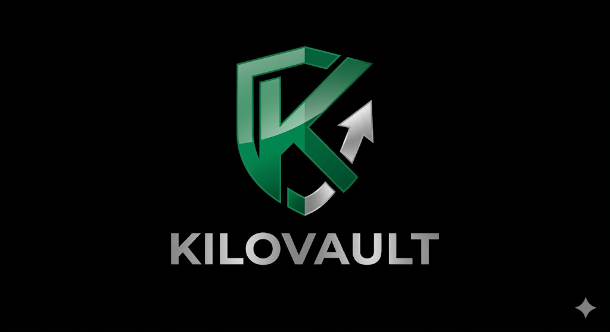

# Kilovault

- Key Value store for bunny.net edge scripts
- Uses crunch.ts as edge rpc style router
- Key/Value pairs are stored in bunny.net libsql database
- Github action used to deplay the script to bunny.net edge network

## Available Routes

The Kilovault service provides the following routes:

### Auth

- **`auth.getToken`** (Public)
  - **Input:** `{ secret: string, userId: string, permissions?: Record<string, boolean> }`
  - **Output:** `{ token: string }`

### History

- **`history.get`** (Requires `admin` permission)
  - **Input:** `{ userId?: string }`
  - **Output:** `{ history: { id: string, key: string, type: string, createdAt: string, userId: string }[] }`
- **`history.cleanup`** (Requires `admin` permission)
  - **Input:** `{}`
  - **Output:** `{ count: number }` (Deletes history older than 30 days)

### System

- **`system.alive`** (Public)
  - **Input:** `{}`
  - **Output:** `{ timestamp: number }`

### Vault

- **`vault.get`** (Requires `vault.get` permission)
  - **Input:** `{ key: string }`
  - **Output:** `{ value: string | undefined }`
- **`vault.set`** (Requires `vault.set` permission)
  - **Input:** `{ key: string, value: string }`
  - **Output:** `{}`

## Development

Start the application in development mode:

```bash
pnpm dev
```

This will start the server on port 5096 and watch for changes in the `src` directory.

## Tests

To run the test suite:

```bash
pnpm test
# To run tests without rebuilding
pnpm test:nobuild
```

## Creating a New Service

To create a new service:

1. Create a new directory or file under `src/services/`.
2. Define the `Request` and `Response` interfaces.
3. Export a `service` object of type `ServiceDefinition<Request, Response>`.

Example:

```typescript
import type { ServiceDefinition } from "@crunch/types/service";

export interface Request { ... }
export interface Response { ... }

export const service: ServiceDefinition<Request, Response> = {
  method: "myservice.action",
  isPublic: false, // Set to true if authorization is not needed
  requiredPermission: ["myservice.action"],
  handler: async (req, ctx) => { ... },
  validation: (input) => { ... }
};
```

## Deployment & GitHub Actions

The project uses a GitHub Action (`.github/workflows/deploy.yaml`) to automatically deploy the script to the bunny.net edge network on push to the `main` branch.
The action uses the `pnpm crunch` script to build the client and `pnpm bundle` to bundle everything into a single file at `dist/index.js`, which is then deployed using `BunnyWay/actions/deploy-script`.
